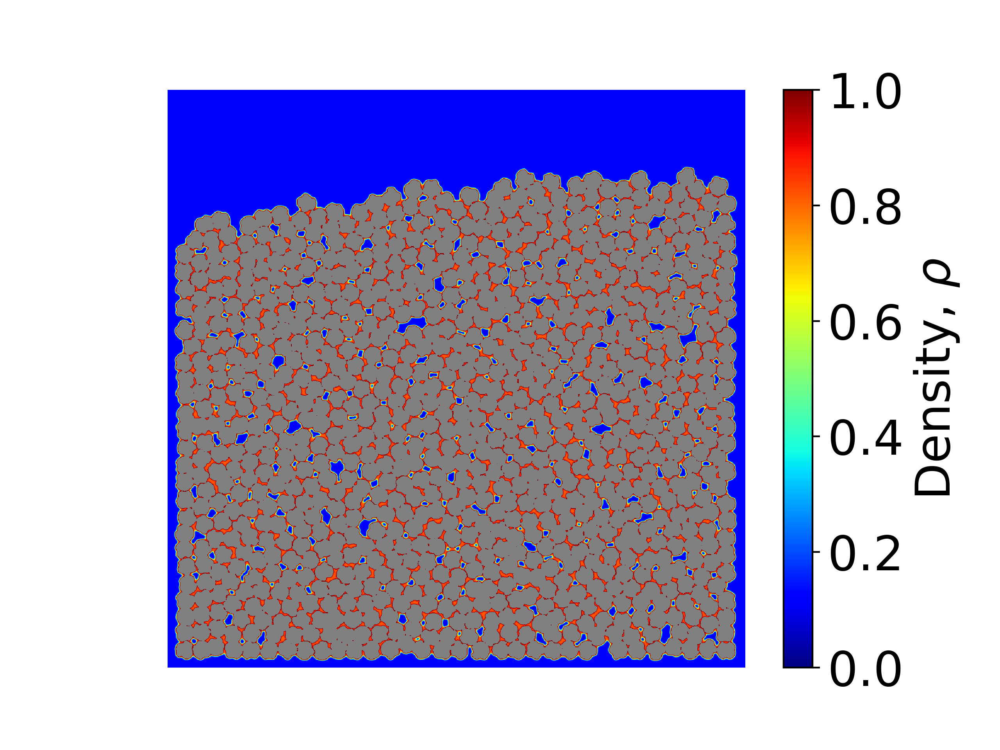

# CGDFT_2D: 2D Coarse-Grained Lattice Gas Density Functional Theory

This is a the 2D version. Parallelized with MPI. To run, ensure that proper number of processors are assigned in the input file. 

## Building 

```
mpic++ -std=c++0x code.cpp -o code
mpiexec -np NumProc code 
```


## Visualizing 

To visualize, modify the exec.sh file included based on the number of time steps and frequency of data output. Make sure the dimensions are correct in the python file. Then: 

```
./exec.sh 

```

